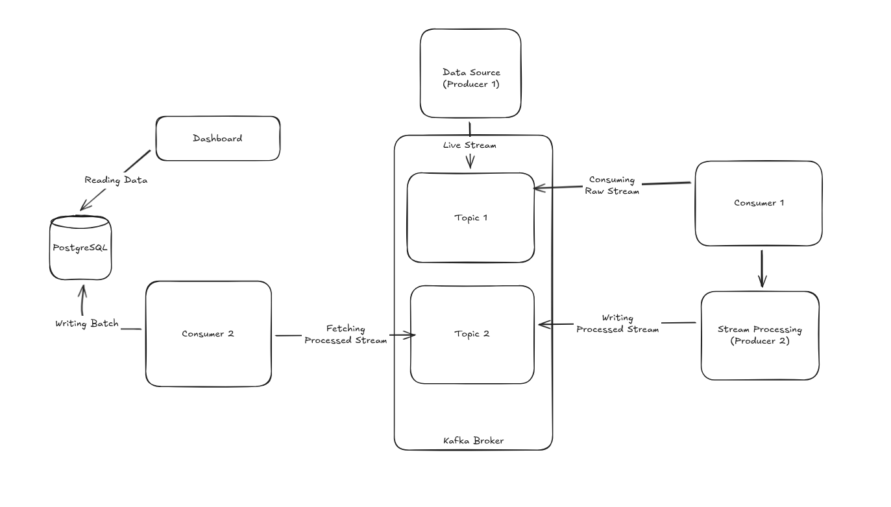

# E-Commerce Logs Analysis

A real-time data pipeline for ingesting, processing, and analyzing e-commerce event data using Apache Kafka, Python, and PostgreSQL.

## Table of Contents

- [Project Overview](#project-overview)
- [Architecture](#architecture)
  - [High-Level Architecture](#high-level-architecture)
  - [High-Level Design](#high-level-design)
- [Components](#components)
- [Prerequisites](#prerequisites)
- [Getting Started](#getting-started)
- [Data Pipeline Flow](#data-pipeline-flow)
- [Technologies Used](#technologies-used)

## Project Overview

This project implements a streaming data pipeline for processing e-commerce event logs in real-time. The system:

- **Generates** synthetic e-commerce events (PAGE_VIEW, ADD_TO_CART, PURCHASE)
- **Validates** event data for quality assurance
- **Processes** events through a stream processor
- **Persists** clean events to PostgreSQL for analysis

The pipeline is built on Apache Kafka for distributed event streaming and includes data validation and batching mechanisms for efficient database operations.

## Architecture

### High-Level Architecture


### High-Level Design



## Components

### 1. Producer (`producer.py`)

Generates synthetic e-commerce events and publishes them to the Kafka `raw_events` topic.

**Features:**
- Generates events with customer IDs, event types, amounts, and timestamps
- Intentionally creates ~25% invalid events for testing validation logic
- Produces events every 500ms
- Supports three valid event types: `PAGE_VIEW`, `ADD_TO_CART`, `PURCHASE`

**Configuration:**
- Bootstrap Servers: `localhost:29092`
- Topic: `raw_events`

### 2. Stream Processor (`streamProcessor.py`)

Consumes raw events from Kafka, validates them, and produces clean events to a separate topic.

**Validation Rules:**
- Event must have a valid `customer_id`
- Event type must be one of: `PAGE_VIEW`, `ADD_TO_CART`, `PURCHASE`
- Amount must be positive and non-zero
- Currency must be present
- Event must be marked as valid (`is_valid: true`)

**Data Flow:**
- Consumes from: `raw_events`
- Produces to: `clean_events`
- Group ID: `silver-stream-processor`

### 3. PostgreSQL Consumer (`psqlConsumer.py`)

Consumes validated events from Kafka and batches them into PostgreSQL for persistent storage.

**Features:**
- Batch processing (500 records per batch) for efficient database operations
- Automatic connection management
- Offset commit only after successful database insertion
- Graceful shutdown with final buffer flush

**Configuration:**
- Topic: `clean_events`
- Group ID: `postgres-loader`
- Batch Size: 500 records
- Database: PostgreSQL on `localhost:5432`

**Database Details:**
- Database: `ecom_kafka`
- Table: `kafka_events_silver`
- Columns: `event_id`, `customer_id`, `event_type`, `amount`, `currency`, `event_timestamp`

## Prerequisites

Before running the project, ensure you have the following installed:

- Python 3.8+
- Docker & Docker Compose
- PostgreSQL 12+ (can be containerized)
- `confluent-kafka` library
- `psycopg2` library

## Getting Started

### Step 1: Install Dependencies

```bash
pip install -r requirements.txt
```

### Step 2: Start Kafka and Other Services

```bash
docker-compose up -d
```

This starts:
- Apache Kafka (KRaft mode)
- Kafka UI (accessible at `http://localhost:8080`)

### Step 3: Set Up PostgreSQL Database

Create the required database and table:

```sql
CREATE DATABASE ecom_kafka;

\c ecom_kafka

CREATE TABLE kafka_events_silver (
    id SERIAL PRIMARY KEY,
    event_id VARCHAR(255) NOT NULL,
    customer_id VARCHAR(255),
    event_type VARCHAR(50),
    amount DECIMAL(10, 2),
    currency VARCHAR(10),
    event_timestamp TIMESTAMP,
    created_at TIMESTAMP DEFAULT CURRENT_TIMESTAMP
);
```

### Step 4: Run the Data Pipeline

In separate terminals, run each component in this order:

**Terminal 1 - Start the Producer:**
```bash
python producer.py
```

**Terminal 2 - Start the Stream Processor:**
```bash
python streamProcessor.py
```

**Terminal 3 - Start the PostgreSQL Consumer:**
```bash
python psqlConsumer.py
```

## Data Pipeline Flow

```
┌─────────────┐         ┌──────────────────┐         ┌───────────────┐         ┌──────────────┐
│  Producer   │         │ Stream Processor │         │  Kafka Topic  │         │ PostgreSQL   │
│             │         │                  │         │ (clean_events)│         │              │
│ Generates   ├────────>│ Validates Events ├────────>│ Clean Events  ├────────>│ Persists     │
│ Raw Events  │         │ Filters Invalid  │         │               │         │ Valid Data   │
└─────────────┘         └──────────────────┘         └───────────────┘         └──────────────┘
  raw_events
  (25% invalid)
```

### Event Lifecycle

1. **Event Generation**: Producer creates events with valid and invalid data
2. **Validation**: Stream Processor evaluates events against business rules
3. **Filtering**: Invalid events are discarded with logging
4. **Persistence**: Valid events are batched and written to PostgreSQL
5. **Monitoring**: Each stage logs its activity to console

## Technologies Used

| Component | Purpose |
|-----------|---------|
| **Apache Kafka** | Distributed event streaming platform |
| **Python 3** | Application development language |
| **confluent-kafka** | Python Kafka client |
| **PostgreSQL** | Relational database for event storage |
| **psycopg2** | PostgreSQL adapter for Python |
| **Docker** | Containerization and orchestration |

## Configuration

All components use the following shared configuration:

- **Bootstrap Servers**: `localhost:29092`
- **Kafka Port (External)**: `29092`
- **PostgreSQL Host**: `localhost`
- **PostgreSQL Port**: `5432`
- **PostgreSQL User**: `postgres`
- **PostgreSQL Password**: `1234`
- **Database Name**: `ecom_kafka`

## Monitoring and Debugging

### Kafka UI

Access Kafka UI to monitor topics and messages:
```
http://localhost:8080
```

### Check Kafka Topics

```bash
kafka-topics --list --bootstrap-server localhost:29092
```

### Query PostgreSQL

```bash
psql -U postgres -d ecom_kafka -c "SELECT COUNT(*) FROM kafka_events_silver;"
```

## Stopping the Pipeline

1. Stop the Python scripts in each terminal (Ctrl+C)
2. Stop Docker services:
   ```bash
   docker-compose down
   ```

## Notes

- Events are generated continuously with 500ms intervals
- Invalid events are logged but not processed to the database
- The stream processor filters events based on business logic rules
- PostgreSQL batching improves write performance and reduces database load
- Kafka offsets are committed only after successful database writes to ensure data consistency

## Future Enhancements

- Add metrics collection and monitoring (Prometheus, Grafana)
- Implement dead-letter queues for failed events
- Add schema validation with Avro or Protocol Buffers
- Create analytics dashboard with event insights
- Implement auto-scaling for high-volume scenarios
